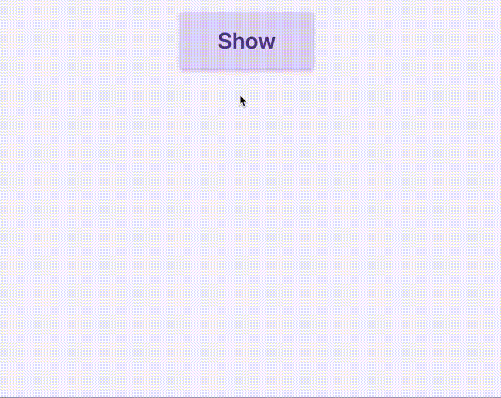

# svelte-closable

A simple svelte action to detect outside clicks.

## Installation

```bash
npm install -S svelte-closable
```

## Usage



```html
<script>
  import closable from 'svelte-closable'

  let button
  let show = false
</script>

<button
  on:click="{ () => show = !show }"
  bind:this="{button}"
>
  Show
</button>

{#if show}
  <div
    class="popup"
    use:closable="{{ exclude: [button] }}"
    on:outside-click="{ () => show = false }"
  ></div>
{/if}
```

This example has a popup that can be opened and closed by clicking the button. Using the closable action, we can also close the popup by clicking outside it.

When the closable action detects an outside click, it emits an event called `outside-click` that we can hook onto to set `show` to false.

Since the button is outside the popup, clicking it causes the `outside-click` event to emit so we end up showing the popup and closing it immediately (so we don't see it open at all). To fix this, we exclude the button from being detected as an outside click. We do that by passing it to the `exclude` array.

## License

[MIT](http://opensource.org/licenses/MIT)
